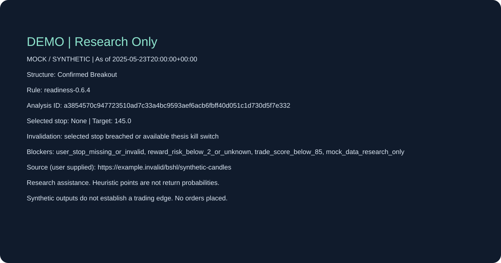

# BSHL — Evidence-first Research & Trade Readiness

[](https://github.com/Sunnyeung369/BSHL_Alpha_Skill/actions/workflows/ci.yml)
[English](#english) · [中文](#中文) · [Quickstart](QUICKSTART.md) · [Release notes](docs/RELEASE_v0.9.0.md)

**Make a market judgment explainable: what supports it, what blocks it, and what would invalidate it.**



## English

BSHL is a lightweight research skill and Python toolkit. Import a dated CSV, supply your research evidence, calculate price structure, check risk gates and preserve the decision for review. It helps you investigate a setup without silently turning missing information into approval.

### A 30-second offline demo after installation

Python 3.10+, an isolated environment, and no API keys. Windows installation includes `tzdata` for exchange timezones.

```shell
git clone https://github.com/Sunnyeung369/BSHL_Alpha_Skill.git
cd BSHL_Alpha_Skill
python -m venv .venv
```

Windows PowerShell:

```powershell
.venv/Scripts/python -m pip install -e ".[dev]"
.venv/Scripts/python scripts/run_demo.py
```

Linux/macOS:

```shell
.venv/bin/python -m pip install -e ".[dev]"
.venv/bin/python scripts/run_demo.py
```

The script generates three Markdown/JSON/SVG cards under `outputs/three-cases`. Installation time is separate; the script reports your measured demo runtime. All bundled data, calendars and evidence are fictional.

| Example | Measured structure | Simulated gate result | Actual research status |
|---|---|---|---|
| [Breakout](examples/current/breakout/card.md) | Confirmed Breakout | Trade Ready | Research Only — mock data |
| [No selected stop](examples/current/no-stop/card.md) | Confirmed Breakout | Avoid | Research Only — mock data |
| [Overheated](examples/current/overheated/card.md) | Exhaustion | Veto | Research Only — mock data |

### What works

| Capability | Implemented boundary |
|---|---|
| [Daily CSV contract](docs/DATA_CONTRACT.md) | Source, timezone, adjustment, availability and declared sessions; invalid input fails |
| Deterministic structure | MA20/50, Wilder ATR14, confirmed pivots, completed parent weeks, breakout/pullback/overheat/breakdown |
| Research and risk cards | Human-supplied evidence/scores; unknown checks, missing stops and kill switches block readiness |
| [Event simulation](docs/BACKTEST.md) | US/USD daily stock/ETF cash profile, next-open fills, exits, bilateral costs, baseline and fixed splits |
| [Local journal](docs/WORKSPACE.md) | Immutable snapshots, watchlist changes, calendar reviews, user choices, outcome review, export and restore |
| Candidate comparison | Same split, complete reports, human holdout approval; no automatic runtime changes |
| [Share card](docs/SHARING.md) | Portable SVG retains identity, time, data mode, rules, source and invalidation |

Legacy live-data adapters are unimplemented and fail explicitly. There is no broker, autonomous order placement, background monitoring, universal multi-market execution or validated trading edge. Scores are experimental heuristics, not return probabilities. Imported sources remain user-supplied and need independent checking. Schema validation verifies format and gates, not factual truth.

### Use your own inputs and preserve the decision

Follow [Quickstart](QUICKSTART.md) for skill loading and CSV analysis, then [the journal guide](docs/WORKSPACE.md) for save → watch → reassess → review → restore. Loading the skill does not create a data-provider account.

Verify with the same environment interpreter:

```shell
python -m unittest discover -s tests -v
python scripts/check_repository.py
```

CI runs Windows, Linux and macOS on Python 3.10 and 3.13. [The roadmap](VERSION_ROADMAP.md) records implementation acceptance; tests do not prove investment performance.

### Contribute a failure before a claim

Share a small reproducible fixture, its decision time and the expected blocker. Read [Contributing](CONTRIBUTING.md). A useful first contribution is an exchange-calendar gap, a delayed publication or an ambiguous stop/target case. Real user feedback is welcome; none is fabricated. Stars/bookmarks can help others find the project, but do not validate a strategy.

## 中文

**证据驱动投研与交易准备。每次判断都说清：依据是什么、被什么阻断、什么变化会让它失效。**

面向想保留研究过程和复盘依据的人。导入带来源与时点的日线CSV，补充人工研究证据，计算K线结构与风险状态，再保存判断。缺止损、未收盘、证据不足、风控未知时，系统不会默认为通过。

当前版本提供可运行的离线研究卡、日线现金模拟、观察列表、事件复核、不可覆盖的决策快照、结果回填、受约束仓位计算，以及导出恢复。演示可在完成安装后快速跑通；三个示例全部使用虚构数据，**“模拟准备就绪”不等于真实交易许可**。

先读[快速开始](QUICKSTART.md)，再按[工作区指南](docs/WORKSPACE.md)完成保存与复盘。真实行情接口、券商下单、后台盯盘和收益优势均未验收。市场首先限定为美股/ETF日线现金研究；其他资产需要独立适配与验证。

欢迎提交失败样本、安装问题和真实使用反馈。标签与封面服务于准确发现和分享，不保证GitHub推荐或自然流量。当前架构和验收见[六批路线](VERSION_ROADMAP.md)；旧设计保存在[历史档案](docs/archive/v0.5-design.md)，不能作为现版本能力证明。

MIT License · [Security](SECURITY.md) · [About](ABOUT.md)
